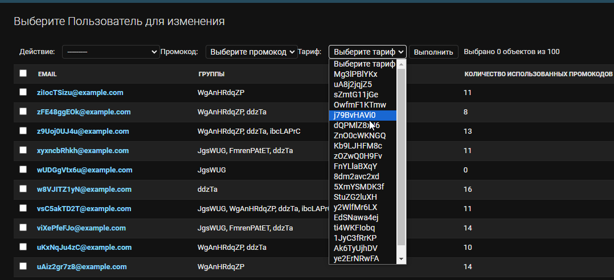
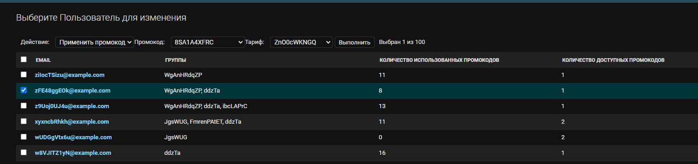
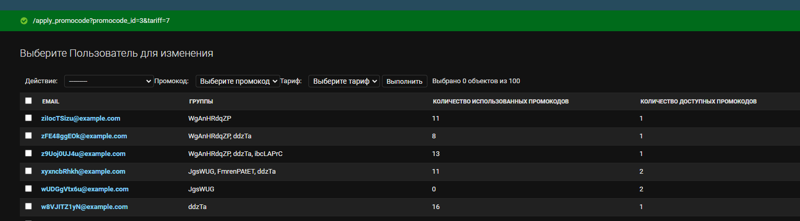
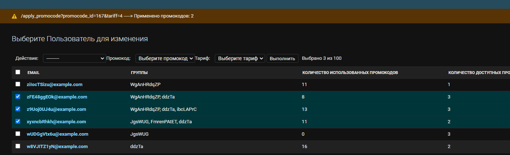
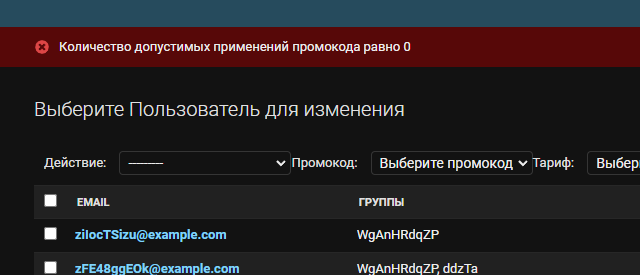
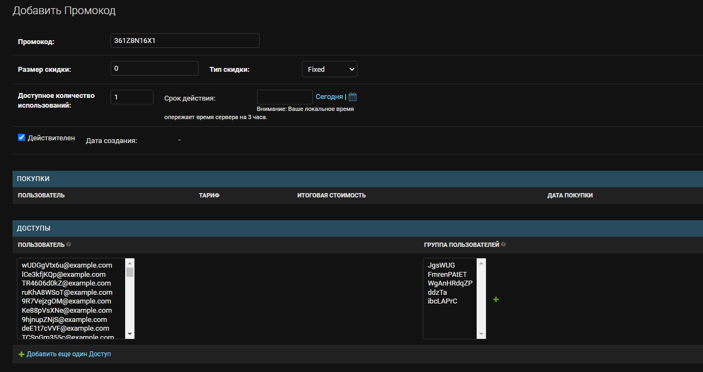
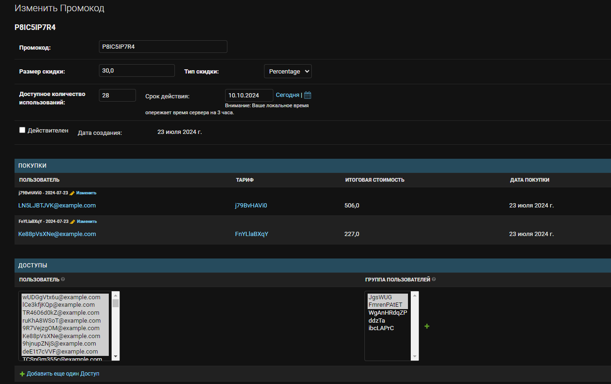

## Сервис лояльности

### Описание основных компонентов

auth - отвечает за аутентификацию пользователей. Стек: FastApi, Redis, Postgres
admin - отвечает за наполнение данными базы по работе с промокодами. Стек: Django, Redis, Postgres
loyalty - отвечает за применение промокодов пользователями. Стек: FastApi, Redis, Postgres

Промокоды назначаются конкретному пользователю или группе (только для зарегистрированных). Информация о зарегистрованных пользователях и их статусе (активный\удален\заблокирован) синхронизируется между сервисами лояльности и аутентификации посредстовм брокера сообщений RabbitMQ.

Тесты - pytest
Логирование - sentry

### Функциональные требования

Купить платную версию за N рублей.
Купить платную версию за 0 рублей (по сути триал).
Сделать скидку M% на покупку платной версии.
Сделать промокод на определенный срок.
Сделать одноразовый промокод.
Сделать многоразовый промокод.
Сделать "применение" промокода со стороны администратора.
Уметь отслеживать, почему именно не прошел промокод.

- Сделать генератор промокодов.
- Сделать отмену применения промокода, если оплата не прошла

### Не функционаные требования

Производительность -
Безопасность -
Надежность -
Масштабируемость -

Время отклика - 200 мск
Количество пользователей -

Комментарии: Персональные данные в auth-сервисе, что позволяет следить только за одним местом хранения. Два контейнера с бд - отдельно для аутентификации, отдельно для лояльности, позволяет распределить нагрузку и повысить отказоустойчивость системы. Работа компоненов организуется через docker-compose.

### Работа с сервисами

loyalty-api:

```
/apply_promocode?promocode_id=5&tariff=1 - применить промокод
/get_active_promocodes - получить список активных промокодов
/use_promocode?promocode_id=200&tariff=1 - покупка тарифа по промокоду
/cancel_apply_promocode?promocode_id=5
```

auth-api:

```
/login - аутентификация
/user_registration - регистрация
/logout - выход
/refresh_token - обновление рефреш токена
/delete - удаление из системы
```

## Работа с миграциями в docker-контейнерах

для работы с миграциями использовалась библиотека alembic

Автоматическое создание миграции
docker-compose exec auth_service alembic revision --autogenerate -m "Сomment migration"

Обновление бд по последней миграции
docker-compose exec auth_service alembic upgrade head

## Работа с админ сервисом ("применение" промокода со стороны администратора)

Для "применения" промокода со стороны администратора необходимо выделить целевых пользователей, выбрать действие "применить промокод", выбрать желаемы промокод и тариф, после чего нажать кнопку "Выполнить":



После нажатия на кнопку "Выполнить" в верхней части экрата отобразится сообщение с результатом выполнения команды:


Можно выделить несколько целевых пользователей. Тогда если у выбранного промокода закончится ресурс на количество применений в процессе выполнения действия, появится соответствующее уведомление:


Если же у промокода будет исчерпан ресурс применения промокода, то высветится соответствующая ошибка:


## -Генератор промокодов

Генератор промокодов находится в функции https://github.com/Andrei-Mihailov/graduate_work/blob/cf8f9b6057eb5761df1b243f4a321c2043f93f06/admin/promocodes/admin.py#L101
сгенерированный промокод автоматически подставляется в поле "Промокод" на странице создания промокода:


Также на странице редактирования/просмотра промокода можно посмотреть все покупки совершенные с использованием данного промокода и доступы пользователей/групп пользователей к этому промокоду:

